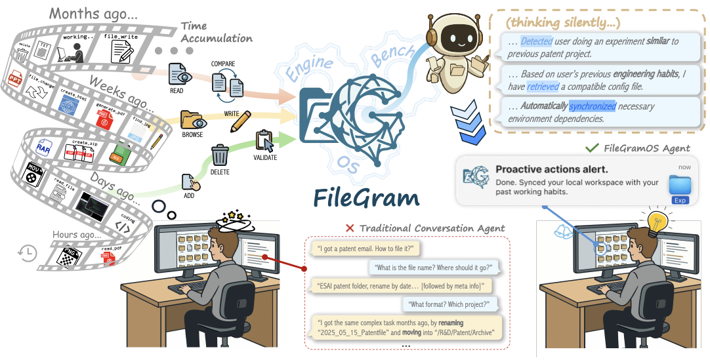
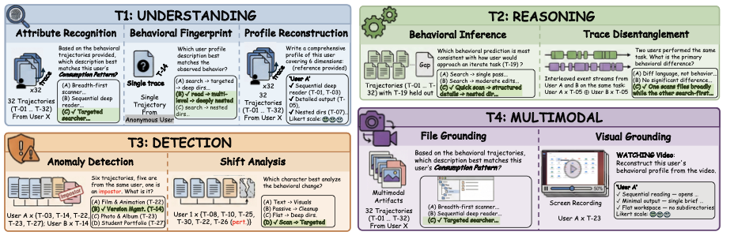
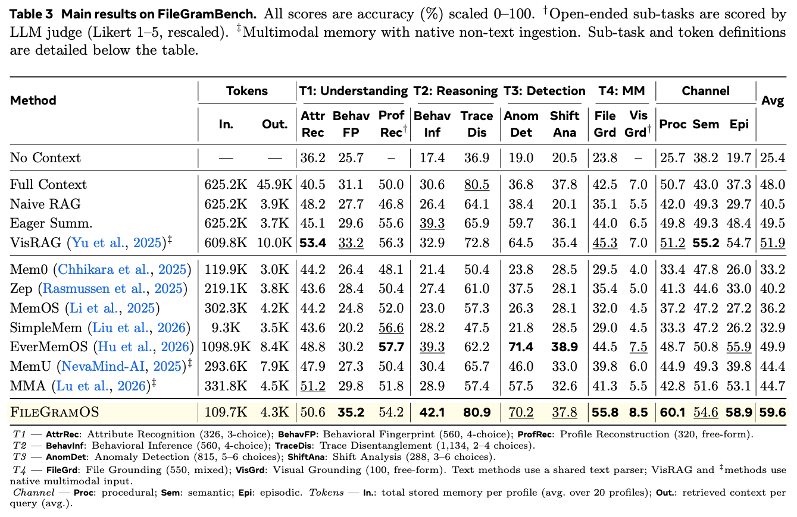

# FileGram

[](#)
[](https://huggingface.co/datasets/Choiszt/FileGram)
[](https://filegram.choiszt.com)
[](LICENSE)
[](https://habitus.choiszt.com)

**Grounding Agent Personalization in File-System Behavioral Traces**

FileGram is a comprehensive framework that grounds agent memory and personalization in file-system behavioral traces. It comprises three core components:

- **FileGramEngine** — A scalable, persona-driven data engine that simulates realistic file-system workflows to generate fine-grained, multimodal behavioral traces.
- **FileGramBench** — A diagnostic benchmark with 4,600+ QA pairs across four evaluation tracks: profile reconstruction, trace disentanglement, anomaly detection, and multimodal grounding.
- **FileGramOS** — A bottom-up memory architecture that builds user profiles directly from atomic file-level signals through procedural, semantic, and episodic channels.

<p align="center">
  
</p>

---

## Quick Start

### Install

```bash
uv sync
```

### Configure

```bash
cp .env.example .env
# Fill in your API keys (Anthropic / Gemini / Cohere)
```

### Run a Trajectory

```bash
# Single trajectory with a profile
filegramengine -1 --autonomous -d /path/to/workspace -p p1_methodical "Analyze and organize the files"

# List available profiles
filegramengine --list-profiles
```

### Run Batch Generation (640 trajectories)

```bash
python scripts/run_all_200.py
```

### Run Evaluation

```bash
# Step 1: Build ingest caches for all baselines
python bench/test_baselines.py --ingest-only

# Step 2: Run QA evaluation
python -m filegramQA.run_qa_eval --cache-dir gemini_2.5_flash --api gemini --mode qa --settings 1 2 3 4 --parallel 20
```

---

## Project Structure

```
FileGram/
├── filegramengine/        # Core package (FileGramEngine)
│   ├── agent/             #   Agent loop and orchestration
│   ├── behavior/          #   Behavioral signal collection (11 event types)
│   ├── llm/               #   LLM providers (Anthropic, Gemini, Azure OpenAI)
│   ├── tools/             #   File operation tools (read, write, edit, grep, bash, etc.)
│   ├── profile/           #   Profile loader + 20 persona YAMLs
│   ├── prompts/           #   System and tool prompt templates
│   └── ...                #   session, storage, snapshot, compaction, etc.
│
├── bench/                 # FileGramBench + FileGramOS
│   ├── baselines/         #   12 baseline adapters + FileGramOS
│   ├── filegramos/        #   FileGramOS core (encoder, consolidator, retriever)
│   ├── evaluation/        #   LLM-as-Judge scoring + MCQ generator
│   └── run_*.py           #   Evaluation runners
│
├── filegramQA/            # QA generation and evaluation
│   ├── generators/        #   Question generators (4 settings)
│   ├── questions/         #   Generated question bank (4,600+)
│   └── run_qa_eval.py     #   QA evaluation runner
│
├── profiles/              # 20 user profile definitions (YAML)
├── tasks/                 # 32 task definitions (JSON)
├── scripts/               # Utility scripts
│   ├── run_all_200.py     #   Generate 640 trajectories (20 profiles × 32 tasks)
│   ├── run_trajectory.sh  #   Run a single trajectory
│   └── convert_multimodal.py  # Convert text outputs to PDF/DOCX/images
│
├── web/                   # Interactive dashboard (local visualization)
├── pyproject.toml
├── .env.example
└── uv.lock
```

---

## Data

**20 user profiles** (6 behavioral dimensions &times; L/M/R tiers) &times; **32 tasks** (6 categories) = **640 trajectories** with ~10K multimodal output files.

---

## Evaluation

### FileGramBench (4 Tracks, 4.6k QA)

| Track | Sub-tasks | #QA |
|-------|----------|:---:|
| T1: Understanding | Attribute Recognition (326), Behavioral Fingerprint (560), Profile Reconstruction (320) | 1,206 |
| T2: Reasoning | Behavioral Inference (560), Trace Disentanglement (1,134) | 1,694 |
| T3: Detection | Anomaly Detection (815), Shift Analysis (288) | 1,103 |
| T4: Multimodal | File Grounding (550), Visual Grounding (100) | 650 |
| **Total** | **9 sub-tasks** | **4,653** |

<p align="center">
  
</p>

### Main Results

<p align="center">
  
</p>

---

## Environment Variables

| Variable | Description |
|----------|-------------|
| `FILEGRAMENGINE_LLM_PROVIDER` | LLM provider: `anthropic`, `google`, or `azure_openai` |
| `ANTHROPIC_API_KEY` | Anthropic API key (for trajectory generation) |
| `GEMINI_API_KEY` | Google Gemini API key (for evaluation) |
| `COHERE_API_KEY` | Cohere API key (for embedding in baselines) |
| `AZURE_OPENAI_API_KEY` | Azure OpenAI API key (optional) |

See `.env.example` for the full configuration template.

---

## Citation

Coming soon.

## License

MIT
